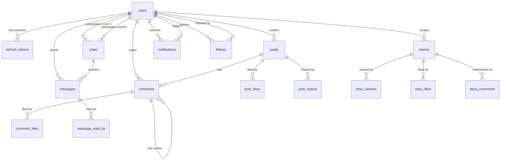

<p align="center">
  
</p>

<h1 align="center">📡 PingUp</h1>

<p align="center">
  <strong>A Real-Time Social Media & Chat Application</strong><br/>
  Built with React · Node.js · Express · MySQL · Socket.io · WebRTC
</p>

<p align="center">
  
  
  
  
  
  
  
  
</p>

---

## 📖 Table of Contents

- [Overview](#-overview)
- [Features](#-features)
- [Tech Stack](#-tech-stack)
- [Architecture](#-architecture)
- [Database Schema](#-database-schema)
- [API Reference](#-api-reference)
- [Real-Time Events (Socket.io)](#-real-time-events-socketio)
- [Getting Started](#-getting-started)
- [Project Structure](#-project-structure)
- [Security](#-security)
- [License](#-license)

---

## 🌐 Overview

**PingUp** is a modern, full-stack social media and real-time chat platform. It combines the core features of popular social networks — feeds, stories, follows, explore — with a fully integrated real-time messaging system and **peer-to-peer audio/video calling** via WebRTC. Built on a relational MySQL database (hosted on Aiven) with a React 19 / Vite 7 frontend and a Node.js / Express 5 backend, PingUp demonstrates advanced proficiency in full-stack development, relational database modeling, real-time networking, WebRTC media streaming, and secure authentication flows.

---

## ✨ Features

### 🔐 Authentication & Security
- **Email/Password** signup & login with `bcryptjs` password hashing
- **Google OAuth 2.0** social login — create new accounts or link to existing email-based accounts
- **Dual-token JWT system**: short-lived access tokens (15 min) + long-lived refresh tokens (7 days)
- **HTTP-only cookies** for refresh tokens (XSS & CSRF mitigation)
- **Automatic token refresh** via Axios interceptors on 401 responses
- **Token rotation**: old refresh token is replaced on every refresh call
- **Password recovery** flow: forgot password → crypto-token email → secure reset
- **Password management**: Google-only users can set a password later via Settings

### 📱 Session Management
- Track active login sessions across multiple devices
- Captured metadata: IP address, user-agent, device name (via `ua-parser-js`), location (via `geoip-lite`)
- Revoke individual sessions or all sessions at once from the Settings page

### 📰 Social Feed
- Infinite-scroll feed of posts from followed users and self
- Create posts with optional image/video media (up to 10 MB, stored on Cloudinary)
- Like, share, and comment on posts
- **Nested/threaded comment replies** with likes and delete
- Post sharing via native Web Share API with clipboard fallback + backend share tracking
- View who shared your posts (post owner only)
- Single-post deep links (`/post/:postId`)

### 🔍 Explore & Discover
- **Discover People** page: find users you don't follow with paginated, searchable results
- **Search**: find users by name or username with debounced live results
- **Suggested users**: sidebar widget recommending new people to follow

### 👤 Profiles & Social Graph
- Customizable profiles: name, username, bio, location, profile picture, cover photo
- **Follow system** with pending/accepted states (follow requests with accept/reject)
- **Connections page** with tabs: Followers, Following, Pending, Connections (union)
- Stats cards showing follower, following, and post counts
- Posts / Media / Likes tabs on profile pages
- Story ring indicator on profile pictures when user has an active story

### 📸 Stories (Instagram-style)
- **Rich story creator**: upload media, add text overlays (captions), emoji stickers, music metadata (Deezer/RapidAPI integration), background colors, image positioning/sizing
- **24-hour auto-expiry** via MySQL scheduled events + server-side cleanup (deletes from DB + Cloudinary every 60 seconds)
- Full-screen story viewer with auto-progress bar and navigation
- Viewer tracking, likes, and comments on stories
- Sequential viewing of all stories from a user
- Story bar with "Create Story" button on the feed

### 💬 Real-Time Chat
- **1-on-1 direct messaging** powered by Socket.io
- Media sharing within messages (images/videos)
- **Typing indicators** with animated dots (real-time)
- **Message status**: sent (✓) → delivered (✓✓ gray) → seen (✓✓ blue)
- Message pagination with infinite scroll for older messages
- Chat list with search, last message preview, and online indicators (green dot)
- Date separators (Today, Yesterday, full dates)
- Smart auto-scroll (only scrolls if near bottom)
- Responsive mobile drawer view with back button
- Emoji picker in chat
- New chat creation from following list

### 📞 Audio & Video Calls
- **WebRTC peer-to-peer** audio and video calls via `simple-peer`
- Socket.io signaling layer (call → incoming → answer → accept → ICE candidates → end)
- **Video call**: full-screen remote video, picture-in-picture local video, mute/camera toggle
- **Audio call**: decorative pulsing ring UI, mute toggle
- Incoming call detection with answer/reject options

### 🔔 Notifications
- **Real-time push notifications** via Socket.io
- Notification types: `like_post`, `like_comment`, `comment`, `reply`, `follow`, `follow_accept`, `follow_reject`, `like_story`, `comment_story`, `share_post`
- Auto-polling every 30 seconds as fallback
- Follow request accept/reject buttons inline in notifications
- Click-to-navigate (to post or to profile)
- Unread indicator styling and count badge
- Auto-cleanup: notifications older than 7 days are deleted via MySQL scheduled events

### ⚙️ Settings
- **Password & Security**: Change password, set password for Google-only accounts
- **Active Sessions**: View devices with icons, location, IP, last seen; revoke individual or all sessions
- **Appearance**: Light/Dark theme toggle (persisted in localStorage, applied via Tailwind `dark:` class strategy)

### 🌙 Dark Mode
- Full dark mode support across the entire application
- Toggle in sidebar + Settings > Appearance
- Uses Tailwind CSS `dark:` variant with class strategy
- Persisted in `localStorage`

### 📱 Responsive Design
- **Mobile-first** layout with responsive breakpoints
- Hamburger menu for sidebar on mobile (`lg:hidden`)
- Mobile drawer sidebar with overlay
- Full-screen chat on mobile with back button
- Responsive grids for connections/discover pages

---

## 🛠️ Tech Stack

### Frontend

| Technology | Version | Purpose |
|---|---|---|
| **React** | 19.1.1 | UI component library |
| **Vite** | 7.1.2 | Build tool & dev server |
| **TailwindCSS** | 4.1.13 | Utility-first CSS framework (via `@tailwindcss/vite` plugin) |
| **React Router DOM** | 7.9.1 | Client-side routing & protected routes |
| **Context API** | — | Global state management (AuthContext + SocketContext) |
| **Axios** | 1.12.2 | HTTP client with interceptors for auto token refresh |
| **Socket.io Client** | 4.8.1 | Real-time WebSocket communication |
| **simple-peer** | 9.11.1 | WebRTC peer-to-peer audio/video calls |
| **@react-oauth/google** | 0.13.5 | Google OAuth integration |
| **react-toastify** | 11.0.5 | Toast notification system |
| **react-icons** | 5.5.0 | Icon library |
| **emoji-picker-element** | 1.27.0 | Emoji picker for chat |

### Backend

| Technology | Version | Purpose |
|---|---|---|
| **Node.js** | — | JavaScript runtime (ES Modules) |
| **Express.js** | 5.1.0 | Web application framework |
| **Socket.io** | 4.8.1 | Real-time bidirectional event-based communication |
| **MySQL2** | — | MySQL driver with promise support & connection pooling |
| **Cloudinary** | v2 | Cloud-based media storage & transformation |
| **JSON Web Tokens** | — | Access & refresh token authentication |
| **bcryptjs** | — | Password hashing |
| **google-auth-library** | — | Google ID token verification |
| **Multer** | — | Multipart file upload handling |
| **Nodemailer** | — | Transactional email (Gmail SMTP) |
| **nanoid / crypto** | — | 24-character hex ID generation (mimics MongoDB ObjectId) |
| **geoip-lite** | — | IP geolocation for session tracking |
| **ua-parser-js** | — | User-agent parsing for device detection |
| **validator.js** | — | Input validation |
| **cookie-parser** | — | HTTP cookie parsing |
| **cors** | — | Cross-Origin Resource Sharing |
| **dotenv** | — | Environment variable management |

### Infrastructure

| Service | Purpose |
|---|---|
| **Aiven MySQL** | Managed cloud MySQL database with SSL |
| **Cloudinary** | Media CDN & storage (posts, stories, messages, profiles) |
| **Gmail SMTP** | Transactional email delivery via Nodemailer |
| **Google Cloud Console** | OAuth 2.0 credentials |
| **RapidAPI (Deezer)** | Music search for story creation |

---

## 🏗️ Architecture

```
┌──────────────────────────────────┐       ┌────────────────────────────────────┐
│           FRONTEND               │       │            BACKEND                 │
│  React 19 + Vite 7 + Tailwind 4  │◄─────►│  Node.js + Express 5 + Socket.io   │
│                                  │ HTTP  │                                    │
│  ┌────────────────────────────┐  │  &    │  ┌────────────┐  ┌─────────────┐  │
│  │    Context Providers       │  │ WS    │  │ Controllers │  │ Middleware   │  │
│  │  AuthContext               │  │  &    │  │             │  │  JWT Auth   │  │
│  │   (auth, profile, posts,   │  │WebRTC │  │  User       │  │  Multer     │  │
│  │    connections, stories)   │  │       │  │  Post       │  │  Error      │  │
│  │  SocketContext             │  │       │  │  Comment    │  └─────────────┘  │
│  │   (socket, calls, typing)  │  │       │  │  Story     │                    │
│  └────────────────────────────┘  │       │  │  Chat      │  ┌─────────────┐  │
│                                  │       │  │  Message   │  │   Models    │  │
│  ┌────────────────────────────┐  │       │  │  Connection│  │  (Raw SQL   │  │
│  │         Pages              │  │       │  │  Notif.    │  │   queries)  │  │
│  │  Home | Profile | Messages │  │       │  └────────────┘  └─────────────┘  │
│  │  Discover | Connections    │  │       │                                    │
│  │  CreateStory | Settings    │  │       │  ┌────────────┐  ┌─────────────┐  │
│  │  Notifications | SinglePost│  │       │  │   Config   │  │   Utils     │  │
│  └────────────────────────────┘  │       │  │  DB Pool   │  │  catchAsync │  │
│                                  │       │  │ Cloudinary │  │  generateId │  │
│  ┌────────────────────────────┐  │       │  │   utils    │  │  jwt helper │  │
│  │       Components           │  │       │  │ (cleanup,  │  │  sendEmail  │  │
│  │  PostCard | Comment        │  │       │  │  UA parse, │  └─────────────┘  │
│  │  StoryViewer | VideoCall   │  │       │  │  GeoIP)    │                    │
│  │  AudioCall | ChatList      │  │       │  └────────────┘                    │
│  │  MusicPicker | EmojiPicker │  │       └──────────┬─────────────────────────┘
│  │  Sidebar | EditProfile     │  │                  │
│  └────────────────────────────┘  │                  │
└──────────────────────────────────┘                  ▼
                                         ┌────────────────────────┐
                                         │     MySQL (Aiven)      │
                                         │  SSL + Connection Pool │
                                         │  16 Tables             │
                                         └────────────────────────┘
                                                      │
                                                      ▼
                                         ┌────────────────────────┐
                                         │     Cloudinary CDN     │
                                         │  posts/ stories/       │
                                         │  messages/ profiles/   │
                                         └────────────────────────┘
```

### Key Design Patterns

| Pattern | Details |
|---|---|
| **Model Layer** | Plain JS objects with static async methods wrapping raw SQL queries (no ORM) |
| **ID Generation** | `crypto.randomBytes(12).toString("hex")` — 24-char hex strings mimicking MongoDB ObjectIDs |
| **JSON Aggregation** | MySQL `JSON_OBJECT()` and `JSON_ARRAYAGG()` used to mimic Mongoose `.populate()` and embedded arrays |
| **Error Handling** | `catchAsync` wrapper + global error handler middleware |
| **Background Cleanup** | `setInterval` runs story cleanup every 60 seconds (deletes expired stories from DB + Cloudinary) |
| **Online Tracking** | In-memory `onlineUsers` map: `userId → [socketId, ...]` (multi-tab support) |
| **Cascading Deletes** | `ON DELETE CASCADE` in MySQL schema handles related data cleanup |

---

## 🗄️ Database Schema

The application uses **16 relational tables** on MySQL. All primary keys are 24-character hexadecimal IDs generated via `crypto.randomBytes`.

### Entity Relationship Diagram



### Table Definitions

#### 1. `users`
| Column | Type | Constraints |
|---|---|---|
| `id` | VARCHAR(24) | PRIMARY KEY |
| `name` | VARCHAR(255) | NOT NULL |
| `username` | VARCHAR(20) | UNIQUE, NOT NULL |
| `email` | VARCHAR(255) | UNIQUE, NOT NULL |
| `password` | VARCHAR(255) | Nullable (Google-only accounts) |
| `providers` | SET('google', 'email') | DEFAULT '' |
| `google_id` | VARCHAR(255) | DEFAULT NULL |
| `profile_pic` | VARCHAR(500) | Default avatar image |
| `cover_pic` | VARCHAR(500) | Default cover image |
| `bio` | VARCHAR(255) | DEFAULT 'Hey There I am using PingUp' |
| `location` | VARCHAR(255) | DEFAULT 'India' |
| `reset_password_token` | VARCHAR(255) | DEFAULT NULL |
| `reset_password_expire` | DATETIME | DEFAULT NULL |
| `created_at` | TIMESTAMP | DEFAULT CURRENT_TIMESTAMP |
| `updated_at` | TIMESTAMP | ON UPDATE CURRENT_TIMESTAMP |

#### 2. `refresh_tokens`
| Column | Type | Constraints |
|---|---|---|
| `id` | VARCHAR(24) | PRIMARY KEY |
| `user_id` | VARCHAR(24) | FK → users(id) ON DELETE CASCADE |
| `token` | TEXT | NOT NULL |
| `user_agent` | VARCHAR(255) | Browser / OS info |
| `ip` | VARCHAR(45) | IPv4 or IPv6 |
| `device_name` | VARCHAR(255) | Parsed device name |
| `location` | VARCHAR(255) | GeoIP location |
| `created_at` | TIMESTAMP | DEFAULT CURRENT_TIMESTAMP |

#### 3. `follows`
| Column | Type | Constraints |
|---|---|---|
| `follower_id` | VARCHAR(24) | PK (composite), FK → users(id) ON DELETE CASCADE |
| `followed_id` | VARCHAR(24) | PK (composite), FK → users(id) ON DELETE CASCADE |
| `status` | ENUM('pending', 'accepted') | DEFAULT 'pending' |
| `created_at` | TIMESTAMP | DEFAULT CURRENT_TIMESTAMP |

#### 4. `posts`
| Column | Type | Constraints |
|---|---|---|
| `id` | VARCHAR(24) | PRIMARY KEY |
| `user_id` | VARCHAR(24) | FK → users(id) ON DELETE CASCADE |
| `caption` | TEXT | — |
| `media_url` | VARCHAR(500) | Cloudinary URL |
| `media_type` | ENUM('image', 'video', '') | — |
| `created_at` | TIMESTAMP | DEFAULT CURRENT_TIMESTAMP |
| `updated_at` | TIMESTAMP | ON UPDATE CURRENT_TIMESTAMP |

#### 5. `post_likes`
| Column | Type | Constraints |
|---|---|---|
| `post_id` | VARCHAR(24) | PK (composite), FK → posts(id) ON DELETE CASCADE |
| `user_id` | VARCHAR(24) | PK (composite), FK → users(id) ON DELETE CASCADE |
| `created_at` | TIMESTAMP | DEFAULT CURRENT_TIMESTAMP |

#### 6. `post_shares`
| Column | Type | Constraints |
|---|---|---|
| `post_id` | VARCHAR(24) | PK (composite), FK → posts(id) ON DELETE CASCADE |
| `user_id` | VARCHAR(24) | PK (composite), FK → users(id) ON DELETE CASCADE |
| `created_at` | TIMESTAMP | DEFAULT CURRENT_TIMESTAMP |

#### 7. `comments`
| Column | Type | Constraints |
|---|---|---|
| `id` | VARCHAR(24) | PRIMARY KEY |
| `post_id` | VARCHAR(24) | FK → posts(id) ON DELETE CASCADE |
| `user_id` | VARCHAR(24) | FK → users(id) ON DELETE CASCADE |
| `parent_id` | VARCHAR(24) | FK → comments(id) ON DELETE CASCADE *(nullable, for nested replies)* |
| `text` | TEXT | NOT NULL |
| `created_at` | TIMESTAMP | DEFAULT CURRENT_TIMESTAMP |
| `updated_at` | TIMESTAMP | ON UPDATE CURRENT_TIMESTAMP |

#### 8. `comment_likes`
| Column | Type | Constraints |
|---|---|---|
| `comment_id` | VARCHAR(24) | PK (composite), FK → comments(id) ON DELETE CASCADE |
| `user_id` | VARCHAR(24) | PK (composite), FK → users(id) ON DELETE CASCADE |

#### 9. `stories`
| Column | Type | Constraints |
|---|---|---|
| `id` | VARCHAR(24) | PRIMARY KEY |
| `user_id` | VARCHAR(24) | FK → users(id) ON DELETE CASCADE |
| `media_url` | VARCHAR(500) | Cloudinary URL |
| `media_type` | ENUM('image', 'video', 'none') | DEFAULT 'none' |
| `background_color` | VARCHAR(20) | DEFAULT '#ffffff' |
| `media_cloudinary_id` | VARCHAR(255) | For Cloudinary deletion |
| `caption` | JSON | Text overlay data (position, font, color, etc.) |
| `emojis` | JSON | Emoji sticker positions & data |
| `music` | JSON | Music metadata (from Deezer API) |
| `image_settings` | JSON | Image positioning, sizing, cropping |
| `created_at` | TIMESTAMP | DEFAULT CURRENT_TIMESTAMP |

> **Auto-expiry**: Stories are cleaned up in two ways:
> 1. **MySQL Event**: Runs every hour to delete old records
>    ```sql
>    CREATE EVENT delete_old_stories
>      ON SCHEDULE EVERY 1 HOUR
>      DO DELETE FROM stories WHERE created_at < NOW() - INTERVAL 24 HOUR;
>    ```
> 2. **Server-side interval**: Runs every 60 seconds, deleting expired stories from both DB and Cloudinary

#### 10. `story_viewers`
| Column | Type | Constraints |
|---|---|---|
| `story_id` | VARCHAR(24) | PK (composite), FK → stories(id) ON DELETE CASCADE |
| `user_id` | VARCHAR(24) | PK (composite), FK → users(id) ON DELETE CASCADE |
| `created_at` | TIMESTAMP | DEFAULT CURRENT_TIMESTAMP |

#### 11. `story_likes`
| Column | Type | Constraints |
|---|---|---|
| `story_id` | VARCHAR(24) | PK (composite), FK → stories(id) ON DELETE CASCADE |
| `user_id` | VARCHAR(24) | PK (composite), FK → users(id) ON DELETE CASCADE |
| `created_at` | TIMESTAMP | DEFAULT CURRENT_TIMESTAMP |

#### 12. `story_comments`
| Column | Type | Constraints |
|---|---|---|
| `id` | VARCHAR(24) | PRIMARY KEY |
| `story_id` | VARCHAR(24) | FK → stories(id) ON DELETE CASCADE |
| `user_id` | VARCHAR(24) | FK → users(id) ON DELETE CASCADE |
| `text` | TEXT | NOT NULL |
| `created_at` | TIMESTAMP | DEFAULT CURRENT_TIMESTAMP |

#### 13. `chats`
| Column | Type | Constraints |
|---|---|---|
| `id` | VARCHAR(24) | PRIMARY KEY |
| `user1_id` | VARCHAR(24) | FK → users(id) ON DELETE CASCADE |
| `user2_id` | VARCHAR(24) | FK → users(id) ON DELETE CASCADE |
| `latest_message_id` | VARCHAR(24) | FK → messages(id) ON DELETE SET NULL |
| `created_at` | TIMESTAMP | DEFAULT CURRENT_TIMESTAMP |
| `updated_at` | TIMESTAMP | ON UPDATE CURRENT_TIMESTAMP |

#### 14. `messages`
| Column | Type | Constraints |
|---|---|---|
| `id` | VARCHAR(24) | PRIMARY KEY |
| `chat_id` | VARCHAR(24) | FK → chats(id) ON DELETE CASCADE |
| `sender_id` | VARCHAR(24) | FK → users(id) ON DELETE CASCADE |
| `content` | TEXT | Message body |
| `media_url` | VARCHAR(500) | Cloudinary URL |
| `media_type` | ENUM('image', 'video', '') | — |
| `status` | ENUM('sent', 'delivered', 'seen') | DEFAULT 'sent' |
| `created_at` | TIMESTAMP | DEFAULT CURRENT_TIMESTAMP |
| `updated_at` | TIMESTAMP | ON UPDATE CURRENT_TIMESTAMP |

#### 15. `message_read_by`
| Column | Type | Constraints |
|---|---|---|
| `message_id` | VARCHAR(24) | PK (composite), FK → messages(id) ON DELETE CASCADE |
| `user_id` | VARCHAR(24) | PK (composite), FK → users(id) ON DELETE CASCADE |

#### 16. `notifications`
| Column | Type | Constraints |
|---|---|---|
| `id` | VARCHAR(24) | PRIMARY KEY |
| `recipient_id` | VARCHAR(24) | FK → users(id) ON DELETE CASCADE |
| `sender_id` | VARCHAR(24) | FK → users(id) ON DELETE CASCADE |
| `type` | VARCHAR(50) | NOT NULL (see notification types below) |
| `post_id` | VARCHAR(24) | Nullable |
| `is_read` | BOOLEAN | DEFAULT FALSE |
| `created_at` | TIMESTAMP | DEFAULT CURRENT_TIMESTAMP |

> **Auto-cleanup**: Notifications older than 7 days are deleted via a MySQL scheduled event:
> ```sql
> CREATE EVENT cleanup_old_notifications
>   ON SCHEDULE EVERY 1 DAY
>   DO DELETE FROM notifications
>      WHERE created_at < DATE_SUB(NOW(), INTERVAL 7 DAY);
> ```

### Notification Types

| Type | Trigger |
|---|---|
| `like_post` | Someone liked your post |
| `share_post` | Someone shared your post |
| `comment` | Someone commented on your post |
| `reply` | Someone replied to your comment |
| `like_comment` | Someone liked your comment |
| `follow` | Someone sent you a follow request |
| `follow_accept` | Someone accepted your follow request |
| `follow_reject` | Someone rejected your follow request |
| `like_story` | Someone liked your story |
| `comment_story` | Someone commented on your story |

---

## 📡 API Reference

All API routes are prefixed with `/api`. Authenticated routes require a valid JWT access token in the `Authorization: Bearer <token>` header.

### User & Auth Routes — `/api/user`

| Method | Endpoint | Auth | Description |
|---|---|---|---|
| `POST` | `/register` | ✗ | Register with email & password |
| `POST` | `/login` | ✗ | Login with email & password |
| `POST` | `/google-login` | ✗ | Login/register via Google OAuth |
| `POST` | `/refresh` | ✗ | Refresh access token (uses HTTP-only cookie) |
| `POST` | `/logout` | ✗ | Logout & revoke current refresh token |
| `POST` | `/forgot-password` | ✗ | Send password reset email |
| `PATCH` | `/reset-password/:token` | ✗ | Reset password with token |
| `POST` | `/update-password` | ✓ | Change or set password |
| `GET` | `/get-profiledata` | ✓ | Get own profile with stats |
| `GET` | `/friendprofiledata/:friendId` | ✓ | Get another user's profile |
| `POST` | `/update-profiledata` | ✓ | Update profile (multipart for images) |
| `GET` | `/all` | ✓ | Get all users (except self) |
| `GET` | `/sessions` | ✓ | List active login sessions |
| `DELETE` | `/sessions/:sessionId` | ✓ | Revoke a specific session |
| `POST` | `/revoke-sessions` | ✓ | Logout from all devices |

### Post Routes — `/api/post`

| Method | Endpoint | Auth | Description |
|---|---|---|---|
| `POST` | `/create-post` | ✓ | Create post (multipart for media) |
| `GET` | `/posts` | ✓ | Get feed posts (self + following) |
| `GET` | `/get-post-by-me` | ✓ | Get own posts |
| `GET` | `/get-post-by-friend/:friendId` | ✓ | Get a friend's posts |
| `GET` | `/:postId` | ✓ | Get single post |
| `POST` | `/delete-post` | ✓ | Delete own post |
| `POST` | `/:postId/like` | ✓ | Toggle like on post |
| `POST` | `/:postId/share` | ✓ | Share a post |
| `GET` | `/:postId/shares` | ✓ | Get list of sharers (owner only) |

### Connection/Follow Routes — `/api/conn`

| Method | Endpoint | Auth | Description |
|---|---|---|---|
| `GET` | `/discover-people` | ✓ | Discover new people (paginated, searchable) |
| `GET` | `/all-conn` | ✓ | Get own connections (following/followers/pending) |
| `GET` | `/friend-conn/:friendId` | ✓ | Get a friend's connections |
| `POST` | `/follow` | ✓ | Send follow request |
| `POST` | `/handle-follow` | ✓ | Accept or reject follow request |
| `POST` | `/unfollow` | ✓ | Unfollow a user |
| `POST` | `/cancel-follow` | ✓ | Cancel pending follow request |

### Comment Routes — `/api/comment`

| Method | Endpoint | Auth | Description |
|---|---|---|---|
| `POST` | `/add` | ✓ | Add comment (supports threaded replies via `parent_id`) |
| `GET` | `/get/:postId` | ✓ | Get comments for post (returned as tree) |
| `DELETE` | `/delete/:commentId` | ✓ | Delete comment (cascades to replies) |
| `POST` | `/like/:commentId` | ✓ | Toggle like on comment |

### Story Routes — `/api/story`

| Method | Endpoint | Auth | Description |
|---|---|---|---|
| `POST` | `/create` | ✓ | Create story (multipart for media + JSON data) |
| `GET` | `/all` | ✓ | Get all active stories (self + following, grouped by user) |
| `DELETE` | `/:storyId` | ✓ | Delete own story |
| `POST` | `/:storyId/like` | ✓ | Toggle like on story |
| `GET` | `/:storyId/likes` | ✓ | Get story likes |
| `POST` | `/:storyId/comment` | ✓ | Add comment to story |
| `GET` | `/:storyId/comments` | ✓ | Get story comments |
| `POST` | `/:storyId/view` | ✓ | Mark story as viewed |
| `GET` | `/:storyId/viewers` | ✓ | Get story viewers |

### Chat & Message Routes — `/api/message`

| Method | Endpoint | Auth | Description |
|---|---|---|---|
| `GET` | `/chats/:userId` | ✓ | Get all chats for a user |
| `POST` | `/create/:user2` | ✓ | Create or find existing 1-on-1 chat |
| `GET` | `/:chatId` | ✓ | Get messages (paginated) |
| `POST` | `/send` | ✓ | Send message (multipart for media) |
| `PUT` | `/read` | ✓ | Mark messages as read |
| `DELETE` | `/` | ✓ | Delete a message |

### Notification Routes — `/api/notifications`

| Method | Endpoint | Auth | Description |
|---|---|---|---|
| `GET` | `/get` | ✓ | Get notifications (last 50) |
| `PUT` | `/mark-read` | ✓ | Mark all notifications as read |

---

## ⚡ Real-Time Events (Socket.io)

The application uses Socket.io for bidirectional real-time communication. The socket server is attached to the Express HTTP server with multi-tab support (one user can have multiple socket connections).

### Client → Server Events

| Event | Payload | Description |
|---|---|---|
| `userOnline` | `userId` | Register user as online |
| `userOffline` | `userId` | Mark user as offline |
| `joinChat` | `chatId` | Join a chat room |
| `sendMessage` | `{ message, receiverId }` | Send message to recipient |
| `typing` | `{ senderId, receiverId }` | Notify recipient of typing |
| `stopTyping` | `{ senderId, receiverId }` | Stop typing notification |
| `messageSeen` | `{ messageIds, senderId }` | Mark messages as seen |
| `messageDelivered` | `{ messageId, senderId }` | Confirm message delivery |
| `callUser` | `{ to, signal, callerInfo }` | Initiate audio/video call |
| `answerCall` | `{ to, signal }` | Answer incoming call |
| `endCall` | `{ to }` | End active call |
| `iceCandidate` | `{ to, candidate }` | Send WebRTC ICE candidate |

### Server → Client Events

| Event | Payload | Description |
|---|---|---|
| `getOnlineUsers` | `[userId, ...]` | Broadcasts list of all online user IDs |
| `receiveMessage` | `message` | Incoming message from another user |
| `userTyping` | `{ senderId }` | Typing indicator |
| `userStoppedTyping` | `{ senderId }` | Stop typing indicator |
| `messageDelivered` | `{ messageId }` | Delivery confirmation |
| `messagesSeen` | `{ messageIds }` | Read receipt notification |
| `incomingCall` | `{ from, signal, callerInfo }` | Incoming audio/video call |
| `callAccepted` | `{ signal }` | Call was accepted |
| `callEnded` | — | Call was terminated |
| `iceCandidate` | `{ candidate }` | Incoming ICE candidate |

---

## 🚀 Getting Started

### Prerequisites

| Requirement | Notes |
|---|---|
| **Node.js** (v18+) | Runtime for backend & frontend tooling |
| **npm** | Package manager |
| **MySQL Database** | Aiven-hosted recommended (SSL required) |
| **Cloudinary Account** | Free tier available — [cloudinary.com](https://cloudinary.com) |
| **Google Cloud Console** | For OAuth 2.0 Client ID — [console.cloud.google.com](https://console.cloud.google.com) |
| **Gmail Account** | For Nodemailer — requires App Password |
| **RapidAPI Key** *(optional)* | For Deezer music search in stories |

### 1. Clone the Repository

```bash
git clone https://github.com/your-username/pingup-sql.git
cd pingup-sql
```

### 2. Backend Setup

```bash
cd backend
npm install
```

Create a `.env` file in the `backend/` directory:

```env
PORT=3000
FRONTEND_URL=http://localhost:5173

# ── MySQL Database (Aiven) ──────────────────────
AIVEN_DB_HOST=your_db_host
AIVEN_DB_PORT=your_db_port
AIVEN_DB_USER=your_db_user
AIVEN_DB_PASSWORD=your_db_password
AIVEN_DB_NAME=your_db_name
NODE_ENV=development
# ⚠️ Place your Aiven ca.pem SSL certificate in the backend root!

# ── JWT Secrets ──────────────────────────────────
JWT_ACCESS_SECRET=your_access_secret
JWT_REFRESH_SECRET=your_refresh_secret

# ── Cloudinary ───────────────────────────────────
CLOUDINARY_CLOUD_NAME=your_cloud_name
CLOUDINARY_API_KEY=your_api_key
CLOUDINARY_API_SECRET=your_api_secret

# ── Google OAuth ─────────────────────────────────
GOOGLE_CLIENT_ID=your_google_client_id
GOOGLE_CLIENT_SECRET=your_google_client_secret

# ── Email (Nodemailer / Gmail) ───────────────────
EMAIL_USERNAME=your_email@gmail.com
EMAIL_PASSWORD=your_gmail_app_password
```

> **Important**: Place your Aiven SSL certificate (`ca.pem`) in the `backend/` root directory.

Start the backend server:

```bash
npm run server     # development (with nodemon auto-restart)
# or
npm start          # production
```

### 3. Frontend Setup

Open a new terminal:

```bash
cd frontend
npm install
```

Create a `.env` file in the `frontend/` directory:

```env
VITE_BACKEND_URL=http://localhost:3000
VITE_GOOGLE_CLIENT_ID=your_google_client_id
VITE_RAPIDAPI_KEY=your_rapidapi_key    # Optional: for music in stories
```

Start the development server:

```bash
npm run dev
```

The app will be available at **http://localhost:5173**. The Vite dev server proxies `/api` and `/socket.io` requests to the backend at port 3000.

### 4. Database Setup

Run the SQL schema against your MySQL database to create all 16 tables. Also create the scheduled events for automatic cleanup:

```sql
-- Auto-delete stories older than 24 hours
CREATE EVENT IF NOT EXISTS delete_old_stories
  ON SCHEDULE EVERY 1 HOUR
  DO DELETE FROM stories WHERE created_at < NOW() - INTERVAL 24 HOUR;

-- Auto-delete notifications older than 7 days
CREATE EVENT IF NOT EXISTS cleanup_old_notifications
  ON SCHEDULE EVERY 1 DAY
  DO DELETE FROM notifications
     WHERE created_at < DATE_SUB(NOW(), INTERVAL 7 DAY);
```

> **Note**: Make sure the MySQL event scheduler is enabled: `SET GLOBAL event_scheduler = ON;`

---

## 📂 Project Structure

```
PingUp - SQL/
├── README.md
│
├── backend/
│   ├── server.js                     # Express 5 + Socket.io entry point
│   ├── package.json
│   ├── ca.pem                        # Aiven SSL certificate
│   ├── .env                          # Environment variables
│   │
│   ├── config/
│   │   ├── db.js                     # MySQL connection pool (Aiven + SSL)
│   │   ├── cloudinary.js             # Cloudinary v2 config
│   │   └── utils.js                  # Story cleanup, UA parsing, GeoIP
│   │
│   ├── middleware/
│   │   ├── auth.js                   # JWT Bearer token verification
│   │   ├── errorMiddleware.js        # Global error handler
│   │   └── multer.js                 # File upload to disk
│   │
│   ├── models/
│   │   ├── UserModel.js              # Users, sessions, profile stats, password reset
│   │   ├── PostModel.js              # Posts with JSON subqueries
│   │   ├── FollowModel.js            # Follow system (discover, request, accept)
│   │   ├── StoryModel.js             # Stories with media, captions, emojis, music
│   │   ├── ChatModel.js              # 1-on-1 chats
│   │   ├── MessageModel.js           # Messages with read receipts
│   │   ├── CommentModel.js           # Nested comments with likes
│   │   └── NotificationModel.js      # Notification CRUD
│   │
│   ├── controllers/
│   │   ├── userController.js         # Auth, profiles, sessions, password reset
│   │   ├── postController.js         # Post CRUD, likes, shares, feed
│   │   ├── connectionController.js   # Follow system
│   │   ├── commentController.js      # Threaded comments, likes
│   │   ├── storyController.js        # Story CRUD, likes, comments, viewers
│   │   ├── chatController.js         # Chat/messaging, typing
│   │   └── notificationController.js # Get/mark-read notifications
│   │
│   ├── routes/
│   │   ├── userRoutes.js
│   │   ├── postRoutes.js
│   │   ├── connectionRoutes.js
│   │   ├── storyRoutes.js
│   │   ├── messageRoutes.js
│   │   ├── commentRoutes.js
│   │   └── notificationRoutes.js
│   │
│   └── utils/
│       ├── catchAsync.js             # Async error wrapper
│       ├── generateId.js             # 24-char hex ID generator
│       ├── jwt.js                    # Token creation + cookie options
│       └── sendEmail.js              # Nodemailer email utility
│
└── frontend/
    ├── index.html                    # Entry HTML (title: "PingUp")
    ├── package.json
    ├── vite.config.js                # Vite + Tailwind + proxy + polyfills
    ├── tailwind.config.js            # Dark mode: "class" strategy
    ├── eslint.config.js
    │
    ├── public/
    │   └── logo.png                  # Favicon
    │
    ├── src/
    │   ├── main.jsx                  # Entry (Google + Router + Auth + Socket providers)
    │   ├── App.jsx                   # Route definitions & layout
    │   ├── index.css                 # Global styles, Tailwind import, animations
    │   │
    │   ├── assets/                   # Static assets (images, logos, samples)
    │   │
    │   ├── context/
    │   │   ├── AuthContext.jsx        # Auth, profile, posts, connections, stories, sessions
    │   │   └── SocketContext.jsx      # Socket.io, online users, typing, WebRTC calls
    │   │
    │   ├── pages/
    │   │   ├── Home.jsx              # Feed (stories bar + posts + sidebar)
    │   │   ├── Login.jsx             # Login/signup + Google OAuth
    │   │   ├── ForgotPassword.jsx    # Forgot password form
    │   │   ├── ResetPassword.jsx     # Reset password with token
    │   │   ├── Profile.jsx           # Own profile (posts/media/likes tabs)
    │   │   ├── ProfileFriend.jsx     # Friend's profile page
    │   │   ├── Messages.jsx          # Real-time chat
    │   │   ├── Connections.jsx       # Followers/following/pending tabs
    │   │   ├── DiscoverPeople.jsx    # Discover users with search
    │   │   ├── CreatePost.jsx        # Post creation with media upload
    │   │   ├── CreateStory.jsx       # Rich story composer (27KB)
    │   │   ├── SinglePost.jsx        # Individual post view
    │   │   ├── Notifications.jsx     # Notification center
    │   │   ├── Settings.jsx          # Password, sessions, appearance
    │   │   └── NotFound.jsx          # Custom 404 page
    │   │
    │   └── components/
    │       ├── Layout.jsx            # Main layout (sidebar + outlet)
    │       ├── Sidebar.jsx           # Desktop navigation sidebar
    │       ├── MiddleSection.jsx     # Feed content area
    │       ├── RightSection.jsx      # Sponsored + suggested users
    │       ├── PostCard.jsx          # Post card with interactions
    │       ├── Comment.jsx           # Comments with nested replies
    │       ├── StoryFeature.jsx      # Story bar on feed
    │       ├── StoryViewer.jsx       # Full-screen story display
    │       ├── StoryViewerContainer.jsx # Story viewer wrapper
    │       ├── VideoCall.jsx         # WebRTC video call UI
    │       ├── AudioCall.jsx         # WebRTC audio call UI
    │       ├── EditProfileModal.jsx  # Profile editing modal
    │       ├── ConnectionsListModal.jsx # Followers/following modal
    │       ├── UserCard.jsx          # User card for search/discover
    │       ├── DarkModeToggle.jsx    # Dark mode toggle button
    │       ├── EmojiPicker.jsx       # Emoji picker for chat
    │       └── MusicPicker.jsx       # Music picker for stories
```

---

## 🛡️ Security

This project implements multiple layers of security:

| Layer | Implementation |
|---|---|
| **Password Storage** | `bcryptjs` salted hashing — never stored in plain text |
| **Authentication** | Dual JWT tokens (access: 15 min, refresh: 7 days) |
| **Cookie Security** | Refresh tokens stored in HTTP-only, secure cookies |
| **Token Rotation** | Refresh tokens are rotated on every use (old token deleted) |
| **CORS** | Configured to allow only the frontend origin with credentials |
| **Password Reset** | Cryptographic reset tokens with 15-minute expiry |
| **Session Tracking** | IP, user-agent, device name, and GeoIP location with remote revocation |
| **File Uploads** | Multer with file size limits, stored via Cloudinary (not on server disk) |
| **SQL Injection** | Parameterized queries via `mysql2` prepared statements |
| **Error Handling** | `catchAsync` wrapper + global error middleware (no stack traces in production) |
| **Secrets Management** | All credentials in `.env` files, excluded from version control via `.gitignore` |
| **SSL/TLS** | Database connection secured via Aiven CA certificate (`ca.pem`) |
| **Input Validation** | `validator.js` for email, username, and input sanitization |

---

## 🎓 About

This project was built as a **college project submission** to demonstrate advanced proficiency in:

- **Full-stack web development** — React 19 + Node.js/Express 5
- **Relational database modeling** — MySQL with 16 normalized tables, foreign keys, cascading deletes, and scheduled events
- **Real-time networking** — WebSockets via Socket.io for chat, typing indicators, notifications, and presence
- **WebRTC media streaming** — Peer-to-peer audio and video calls via `simple-peer`
- **Secure authentication flows** — JWT dual-token system, OAuth 2.0, password recovery
- **Cloud media management** — Cloudinary integration for all media types
- **Responsive, mobile-first UI design** — Tailwind CSS with full dark mode support

---

<p align="center">
  Built with ❤️ using React · Node.js · Express · MySQL · Socket.io · WebRTC
</p>
